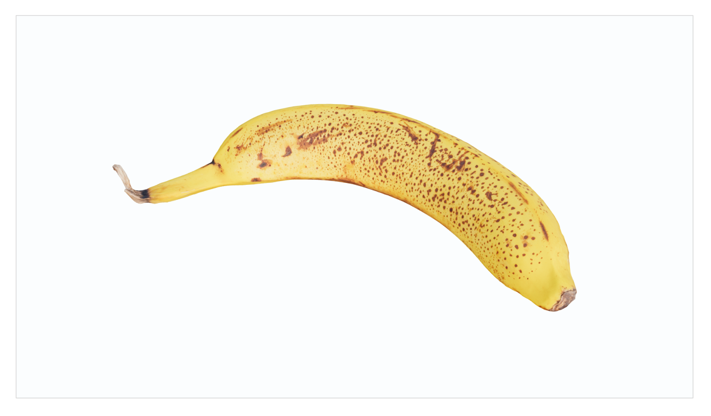

# TinyViewer

This project created for easy displaying 3D scenes in React applications using three.js
The package provided as is, without build.

The Viewer can be imported like this: 

```typescript
import {Viewer} from 'tiny-viewer';
```

and then used like this:

```typescript
import {Viewer, viewerUtils} from 'tiny-viewer';

import './SmallPreview.scss';

const modelUrl = './data/banana.glb';
const SmallPreview = () => {
  const object3D = viewerUtils.loadGLB(modelUrl)
  return <div className="small-preview-wrapper">
    <Viewer object3D={object3D}/>
  </div>
}
```


The component takes all available space inside a wrapper and adjust the Renderer with resize.

```css
.small-preview-wrapper {
  width: 1080px;
  height: 610px;
  border: 1px solid lightgrey;
}
```

The Viewer includes several properties for controlling the scene:

```html
<Viewer
    animationRunner={animationRunner}
    dispatchers={{setScene}}
    object3D={object3D}
    onSceneReady={onSceneReady}
    options={options}/>
```

All properties are optional.

The animationRunner is a function for animation loop.

The object3D is a promise of `THREE.Object3D`.

Dispatchers allow you to get access to internal objects, such as Scene, Camera, Controls and Renderer
For example, you can define a state in your app and pass the `setScene` to dispatchers to set the `scene` 
```const [scene, setScene] = useState<THREE.Scene | null>(null);```

onSceneReady is a simple flag that will be set to true when everything is loaded and ready to be displayed.

options allow us to use some pre-defined features, such as default light and helpers.

```typescript
export const DEFAULT_VIEWER_OPTIONS: ViewerOptions = {
addDefaultHelpers: true,
addDefaultLight: true,
environment: DEFAULT_ENVIRONMENT,
}
```

`environment` is a TypeScript object that defines the default options for an "Environment" in the 3D Scene.

- The `clientHeight` and `clientWidth` properties specify the dimensions of the environment in pixels.

- The `lightOptions` object contains properties for configuring the lighting in the environment:
  - `lightIntensity` is a number that specifies the intensity of the light,
  - `skyColor` is a hexadecimal color code that specifies the color of the sky,
  - `groundColor` is a hexadecimal color code that specifies the color of the ground.

- The `sceneOptions` object contains properties for configuring the scene:
    - `fog` is an object with properties for configuring fog in the scene,
    - `sceneColor` is a hexadecimal color code that specifies the overall color of the scene,
    - `envMapUrl` is a string that specifies the URL of a high dynamic range (HDR) image to use as an environment map for the scene.
